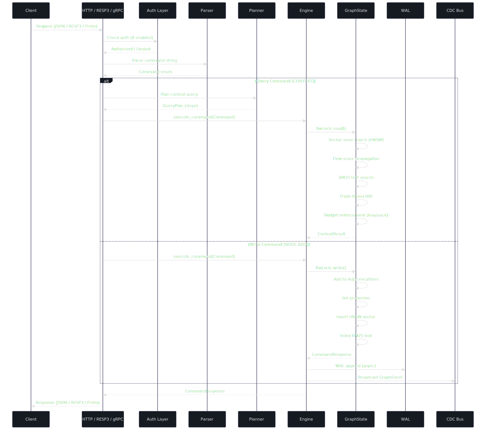

# Weav Architecture

Weav is a Rust in-memory context graph database built for AI/LLM workloads. It combines a property graph, HNSW vector index, and BM25 text search into a single process with Redis-like operational simplicity.

This document describes the production architecture, component design, data flow, and operational characteristics.

---

## Table of Contents

1. [System Overview](#system-overview)
2. [Crate Dependency Graph](#crate-dependency-graph)
3. [Request Lifecycle](#request-lifecycle)
4. [Storage Architecture](#storage-architecture)
5. [Context Query Pipeline](#context-query-pipeline)
6. [Ingestion Pipeline](#ingestion-pipeline)
7. [Concurrency Model](#concurrency-model)
8. [Feature Flags & Build Profiles](#feature-flags--build-profiles)
9. [Type System](#type-system)
10. [Graph Algorithms](#graph-algorithms)
11. [Protocol Layer](#protocol-layer)
12. [HTTP API Reference](#http-api-reference)
13. [Persistence & Recovery](#persistence--recovery)
14. [Authentication & Authorization](#authentication--authorization)
15. [Observability](#observability)
16. [SDKs](#sdks)
17. [Configuration Reference](#configuration-reference)

---

## System Overview

Weav runs as a single process serving three protocols simultaneously:

| Protocol | Default Port | Use Case |
|----------|-------------|----------|
| HTTP/REST | 6382 | Primary API, SDKs, browser clients |
| RESP3 | 6380 | Redis-compatible CLI, high-throughput pipelining |
| gRPC | 6381 | Service mesh, streaming, typed clients |

The server is structured as 11 Rust crates with explicit dependency boundaries and no cyclic dependencies. Heavy subsystems (vector search, document extraction, gRPC, TLS, metrics) are feature-gated so operators can build a minimal binary or a fully-featured one.

### Key Design Decisions

- **Single-process, in-memory**: All data lives in RAM. No external dependencies (no Postgres, no Redis, no S3). Persistence is WAL + snapshots to local disk.
- **Per-graph isolation**: Each graph has its own `AdjacencyStore`, `PropertyStore`, `VectorIndex`, `TextIndex`, and `StringInterner` behind an independent `RwLock`.
- **Triple-fusion retrieval**: Context queries combine vector search (HNSW), graph traversal (personalized PageRank), and text search (BM25) via Reciprocal Rank Fusion.
- **Token-budget-aware**: All retrieval respects LLM token limits. A greedy knapsack packs context chunks by value-density (relevance/tokens).
- **Bi-temporal**: Every entity tracks both real-world validity (`valid_from/valid_until`) and database transaction time (`tx_from/tx_until`).

---

## Crate Dependency Graph



```
weav-core         Foundation: types, errors, config, shard, events, context types
├── weav-graph    Adjacency store, property store, text index, 40+ algorithms
├── weav-vector   HNSW vector index (usearch), token counting (tiktoken-rs)     [optional]
├── weav-persist  Write-ahead log, snapshots, recovery manager
├── weav-auth     ACL store, API keys, Argon2id password hashing
├── weav-query    Command parser (28 commands), planner, executor, budget
│   └── weav-vector  [optional, feature: vector]
├── weav-extract  Document parsing, LLM entity extraction, chunking             [optional]
│   └── weav-graph
├── weav-proto    RESP3 codec (tokio-util), gRPC (tonic/prost)                  [optional]
│   └── weav-query
└── weav-server   HTTP server (axum), engine coordinator, binary entry point
    ├── all above crates
    ├── weav-cli   Interactive REPL client (rustyline)
    └── weav-mcp   Model Context Protocol tools (28 tools)
```

### Crate Responsibilities

| Crate | Lines | External Deps | Role |
|-------|-------|---------------|------|
| `weav-core` | ~2K | 0 heavy | Types, errors, config, shard routing, events, string interning |
| `weav-graph` | ~5K | roaring, strsim | Adjacency (SmallVec), properties, BM25 text index, 40+ graph algorithms |
| `weav-vector` | ~1K | usearch, tiktoken-rs | HNSW index (m=16, ef=200), filtered search, token counting |
| `weav-query` | ~2K | — | Command parser, query planner, context executor, budget enforcement |
| `weav-persist` | ~1K | bincode, crc32fast | Append-only WAL, full snapshots, crash recovery |
| `weav-auth` | ~1K | argon2, rand | User ACL, API key management, command classification |
| `weav-extract` | ~2K | llm, pdf_oxide, text-splitter | Document parsing, LLM extraction, chunking, dedup |
| `weav-proto` | ~1K | tonic, prost | RESP3 binary codec, gRPC service definition |
| `weav-server` | ~7K | axum, tokio, prometheus | Engine coordinator, HTTP/RESP3/gRPC servers, metrics |
| `weav-cli` | ~500 | rustyline | Interactive REPL over RESP3 |
| `weav-mcp` | ~3K | rmcp | 28 MCP tools for AI agent integration |

---

## Request Lifecycle



Every request follows the same pipeline regardless of protocol:

### 1. Transport decode
- HTTP: JSON body → serde deserialize
- RESP3: Binary frame → tokio-util codec decode
- gRPC: Protobuf → prost deserialize

### 2. Authentication (if enabled)
- Check `Authorization` header / RESP3 `AUTH` command
- Validate against ACL store (user permissions, key-space patterns)
- Command classification: `@read`, `@write`, `@admin`

### 3. Parse
`weav_query::parser::parse_command(input) → Result<Command, WeavError>`

The parser handles 28 command variants covering graph CRUD, node/edge operations, search, schema, persistence, and admin.

### 4. Plan (context queries only)
`weav_query::planner::plan_context_query(query) → QueryPlan`

Produces a sequence of `PlanStep`s: VectorSearch, NodeLookup, FlowScore, TemporalFilter, BudgetEnforce, etc.

### 5. Execute
`Engine::execute_command(cmd) → Result<CommandResponse, WeavError>`

- Acquires read or write lock on the target graph's `GraphState`
- Dispatches to the appropriate handler
- For writes: appends to WAL (if enabled), broadcasts CDC event

### 6. Serialize and respond
`CommandResponse` → JSON / RESP3 / Protobuf

---

## Storage Architecture



### GraphState

Each named graph is an independent `GraphState` behind an `Arc<RwLock<>>`:

```rust
struct GraphState {
    adjacency: AdjacencyStore,       // Topology: nodes, edges, SmallVec adjacency lists
    properties: PropertyStore,       // Key-value properties, secondary indexes
    vector_index: VectorIndex,       // HNSW nearest-neighbor index (usearch)
    text_index: TextIndex,           // BM25 inverted index
    interner: StringInterner,        // Label/property-key → u16 compression
    config: GraphConfig,             // TTL, conflict policy, temporal settings
    next_node_id: NodeId,            // Auto-incrementing
    next_edge_id: EdgeId,
    access_times: HashMap<NodeId, u64>,  // LRU eviction timestamps
}
```

### AdjacencyStore

Topology storage optimized for graph traversal:

- **Forward adjacency**: `HashMap<LabelId, HashMap<NodeId, SmallVec<[(NodeId, EdgeId); 8]>>>` — outgoing edges per label
- **Backward adjacency**: Same structure for incoming edges
- **Edge metadata**: `HashMap<EdgeId, EdgeMeta>` — source, target, label, temporal, weight
- **Pair index**: `HashMap<(NodeId, NodeId), SmallVec<[EdgeId; 4]>>` — O(1) edge lookup between any pair
- **Node bitmap**: `RoaringTreemap` — O(1) node existence checks, space-efficient

The `SmallVec<[(NodeId, EdgeId); 8]>` stores up to 8 neighbors on the stack without heap allocation. This covers 90%+ of real-world node degrees.

### PropertyStore

- **Node/edge properties**: `HashMap<NodeId, Vec<(PropertyKeyId, Value)>>`
- **Secondary index**: `HashMap<key, HashMap<serialized_value, Vec<NodeId>>>` — O(1) exact-match lookups via `CREATE INDEX`
- **BM25 auto-indexing**: String properties are automatically indexed for full-text search

### VectorIndex

- **Backend**: usearch HNSW (Hierarchical Navigable Small World)
- **Config**: m=16, ef_construction=200, ef_search=50 (tunable per-graph)
- **Metrics**: Cosine, Euclidean, DotProduct
- **Filtered search**: Label/property post-filtering with 4x oversample
- **Dimensions**: 1536 default (OpenAI ada-002), max 4096

### StringInterner

Labels (`"Person"`, `"KNOWS"`) and property keys (`"name"`, `"age"`) are stored as `u16` IDs via bidirectional maps. A graph with 1M nodes and 10 properties per node saves ~76MB of heap string storage.

---

## Context Query Pipeline



The context query is Weav's core retrieval primitive. It returns token-budgeted, relevance-ranked context for LLM consumption.

### Step 1: Seed Acquisition

Three seed strategies:

| Strategy | Input | Mechanism |
|----------|-------|-----------|
| `Vector` | embedding + top_k | HNSW nearest-neighbor search |
| `Nodes` | entity key strings | Property scan on `entity_key` field |
| `Both` | embedding + keys | Union of vector results and key lookups |

### Step 2: Flow Score Propagation

`flow_score(adjacency, seeds, alpha=0.5, theta=0.01, max_depth)` — Personalized PageRank variant.

Starting from seed nodes, scores propagate through the graph with exponential decay (alpha) per hop. Nodes below the threshold (theta) are pruned. This captures structural relevance: nodes that are close to seeds in the graph topology score higher.

### Step 3: Triple-Fusion RRF

When multiple ranking signals are available, they are combined via Reciprocal Rank Fusion:

```
RRF_score(d) = Σᵢ wᵢ / (k + rankᵢ(d))
```

Three rankers with weights:
- **Vector search** (w=1.0): Semantic similarity
- **Graph traversal** (w=1.0): Structural proximity
- **BM25 text search** (w=0.8): Lexical relevance

The smoothing constant k=60 follows Cormack et al. 2009.

### Step 4: Chunk Building

For each scored node:
1. Read all properties → build content string (concatenated string-type values)
2. Resolve label (via interner or `_label` property)
3. Count tokens (tiktoken cl100k_base or char/4 approximation)
4. Extract provenance and bi-temporal metadata
5. Apply temporal filter (`temporal_at` parameter)
6. Apply decay function (exponential, linear, or step)
7. Detect property conflicts between same-label nodes

### Step 5: Budget Enforcement

The `enforce_budget` function implements a greedy knapsack:

1. Compute value-density: `relevance_score / token_count` for each chunk
2. Sort by density descending
3. Include chunks until `max_tokens` is exhausted
4. Return included chunks re-sorted by relevance, plus utilization ratio

Additional strategies available:
- **DiversityAware (MMR)**: Maximum Marginal Relevance balances relevance and diversity
- **SubmodularFacilityLocation**: Submodular optimization maximizes information coverage
- **Proportional**: Allocates budget percentages to entity/relationship/text categories
- **Priority**: Fills categories in priority order

### Step 6: Output

The `ContextResult` contains:
- `chunks`: Ordered list of `ContextChunk` (node_id, content, label, relevance_score, token_count, relationships, temporal, provenance)
- `total_tokens`, `budget_used`: Budget accounting
- `conflicts`: Detected contradictions between chunks
- `timing`: Per-step microsecond breakdown (seed, flow, fusion, chunk, budget)
- `formatted_messages`: Optional LLM-ready format (Anthropic `<context>` tags or OpenAI system/user messages)
- `subgraph`: Optional node/edge structure for visualization

---

## Ingestion Pipeline



The `POST /v1/graphs/{graph}/ingest` endpoint runs the full extraction pipeline:

### Stage 1: Document Parsing
- **PDF**: `pdf_oxide` extracts text from pages (feature-gated: `pdf`)
- **DOCX**: `zip` + XML parsing extracts paragraphs (feature-gated: `pdf`)
- **CSV**: Column-based extraction with header mapping
- **Text**: Pass-through

### Stage 2: Chunking
- Recursive text splitter (via `text-splitter` crate)
- Configurable chunk size and overlap
- Token-aware boundaries (tiktoken)

### Stage 3: Entity Extraction (feature-gated: `llm-providers`)
- Batched LLM calls (configurable concurrency via `Semaphore`)
- Structured JSON output: entities with types, descriptions, properties
- Relationship extraction: source → target with type and weight

### Stage 4: Deduplication
- **Entities**: Jaro-Winkler fuzzy matching (threshold: 0.85), merge with conflict policy
- **Relationships**: Exact match on (source, target, type), deduplicated

### Stage 5: Graph Construction
- Create nodes with labels, properties, embeddings, and `entity_key`
- Create edges with types, weights, and properties
- All updates are WAL-logged and CDC-broadcast

### LLM Backends
- OpenAI, Anthropic, Ollama (local), AWS Bedrock, custom `base_url`
- Separate backends for extraction (chat) and embeddings (embedding)

---

## Concurrency Model



### Lock Hierarchy

```
Engine
├── RwLock<HashMap<String, Arc<RwLock<GraphState>>>>   ← Outer: graph registry
│   ├── read:  concurrent access to different graphs
│   └── write: graph create/drop only (rare)
│
├── Per-graph: Arc<RwLock<GraphState>>                 ← Inner: per-graph isolation
│   ├── read:  queries, searches, info, stats
│   └── write: node/edge add/delete/update
│
├── Mutex<WriteAheadLog>                                ← WAL: serializes all writes
│
└── broadcast::channel<GraphEvent>                      ← CDC: fan-out to subscribers
```

### Concurrency Guarantees

- **Read-read**: Fully parallel across and within graphs
- **Read-write on same graph**: Readers block on write lock acquisition, no starvation (parking_lot fairness)
- **Write-write on same graph**: Serialized (RwLock)
- **Write-write on different graphs**: Fully parallel (independent locks)
- **WAL writes**: Serialized (Mutex), but non-blocking for queries (WAL append happens after response)

### Background Tasks

| Task | Interval | Lock |
|------|----------|------|
| TTL sweep | 60s | Write lock per graph |
| Snapshot | 3600s (configurable) | Read lock per graph |
| WAL sync | 1s (if `EverySecond` mode) | WAL Mutex |

---

## Feature Flags & Build Profiles



Weav uses Cargo feature flags to enable modular builds. All features are on by default for backward compatibility.

### weav-server features

| Feature | Dependencies Added | What It Enables |
|---------|-------------------|-----------------|
| `vector` | weav-vector, usearch, tiktoken-rs | HNSW vector index, token counting, vector search endpoints |
| `extract` | weav-extract, llm, pdf_oxide, text-splitter, zip | Document ingestion, LLM extraction, `/ingest` endpoint |
| `grpc` | tonic, prost | gRPC server on port 6381 |
| `tls` | rustls, tokio-rustls | TLS encryption for gRPC and RESP3 |
| `resp3` | weav-proto | RESP3 binary protocol server on port 6380 |
| `observability` | prometheus | Prometheus metrics, `/metrics` endpoint |
| `csv-export` | csv | CSV import/export endpoints |
| `full` | All of the above | Convenience alias |

### weav-extract sub-features

| Feature | Dependencies | What It Enables |
|---------|-------------|-----------------|
| `pdf` | pdf_oxide, zip | PDF and DOCX parsing |
| `llm-providers` | llm, schemars | LLM entity extraction, schema generation |

### Build Profiles

```bash
# Minimal: HTTP-only graph database (12 MB, 10s build)
cargo build -p weav-server --no-default-features

# Standard: Graph + RESP3 + vector search (25 MB, 20s build)
cargo build -p weav-server --no-default-features --features resp3,vector

# Full: Everything (64 MB debug / 28 MB release, 65s build)
cargo build -p weav-server

# Release: Optimized, stripped (28 MB)
cargo build -p weav-server --release
```

---

## Type System

### Core Types

```rust
type NodeId = u64;
type EdgeId = u64;
type GraphId = u32;
type ShardId = u16;
type LabelId = u16;           // Interned label (max 65,536 unique per graph)
type PropertyKeyId = u16;     // Interned property key
type Timestamp = u64;         // Milliseconds since Unix epoch
```

### Value (dynamic property type)

```rust
enum Value {
    Null,
    Bool(bool),
    Int(i64),
    Float(f64),
    String(CompactString),    // Stack-allocated for short strings
    Bytes(Vec<u8>),
    Vector(Vec<f32>),
    List(Vec<Value>),
    Map(Vec<(String, Value)>),
    Timestamp(u64),
}
```

### BiTemporal

Every entity tracks two time dimensions:

```rust
struct BiTemporal {
    valid_from: u64,     // When the fact became true in the real world
    valid_until: u64,    // When the fact stopped being true (u64::MAX = still valid)
    tx_from: u64,        // When the fact was recorded in the database
    tx_until: u64,       // When the record was superseded (u64::MAX = current)
}
```

This enables point-in-time queries: "What did the graph look like at timestamp T?" and "What was recorded as of transaction T?"

### Provenance

```rust
struct Provenance {
    source: CompactString,                    // "gpt-4-turbo", "user-input", "sec-filing-10k"
    confidence: f32,                          // [0.0, 1.0]
    extraction_method: ExtractionMethod,      // LlmExtracted, NlpPipeline, UserProvided, Derived, Imported
    source_document_id: Option<CompactString>,
    source_chunk_offset: Option<u32>,
}
```

### Error Types

All fallible operations return `Result<T, WeavError>`. The error enum covers:

| Category | Variants |
|----------|----------|
| Graph | `GraphNotFound`, `NodeNotFound`, `EdgeNotFound`, `DuplicateNode` |
| Constraints | `Conflict`, `DimensionMismatch`, `CapacityExceeded`, `TokenBudgetExceeded` |
| Infrastructure | `PersistenceError`, `ProtocolError`, `ShardUnavailable`, `InvalidConfig` |
| Query | `QueryParseError`, `Internal` |
| Auth | `AuthenticationRequired`, `AuthenticationFailed`, `PermissionDenied` |
| Extract | `ExtractionError`, `DocumentParseError`, `LlmError`, `ExtractionNotEnabled` |

---

## Graph Algorithms

40+ algorithms organized by category:

### Centrality (9)

| Algorithm | Complexity | Function |
|-----------|-----------|----------|
| PageRank (personalized) | O(V + E) per iteration | `personalized_pagerank()` |
| Betweenness | O(V * E) | `betweenness_centrality()` |
| Closeness | O(V * (V + E)) | `closeness_centrality()` |
| Degree | O(V) | `degree_centrality()` |
| Eigenvector | O(V + E) per iteration | `eigenvector_centrality()` |
| Harmonic | O(V * (V + E)) | `harmonic_centrality()` |
| Katz | O(V + E) per iteration | `katz_centrality()` |
| ArticleRank | O(V + E) per iteration | `article_rank()` |
| HITS (Hubs & Authorities) | O(V + E) per iteration | `hits()` |

### Community Detection (3)

| Algorithm | Method | Function |
|-----------|--------|----------|
| Louvain / Modularity | Greedy modularity optimization | `modularity_communities()` |
| Leiden | Hierarchical refinement | `leiden_communities()` |
| Label Propagation | Randomized label spreading | `label_propagation()` |

### Paths & Traversal (6)

| Algorithm | Function |
|-----------|----------|
| BFS | `bfs()` |
| Dijkstra (weighted shortest path) | `dijkstra_shortest_path()` |
| A* (heuristic shortest path) | `astar_shortest_path()` |
| Yen's K-shortest paths | `k_shortest_paths()` |
| Bellman-Ford (negative weights) | `bellman_ford()` |
| Flow Score (personalized propagation) | `flow_score()` |

### Structural Analysis (5)

| Algorithm | Function |
|-----------|----------|
| Strongly Connected Components (Tarjan) | `tarjan_scc()` |
| Weakly Connected Components (Union-Find) | `connected_components()` |
| Topological Sort | `topological_sort()` |
| Triangle Count | `triangle_count()` |
| K-Core Decomposition | `k_core_decomposition()` |

### Graph Embeddings (2)

| Algorithm | Function |
|-----------|----------|
| FastRP (Fast Random Projection) | `fastrp_embeddings()` |
| Node2Vec (biased random walks) | `node2vec_walks()` |

### Similarity (4)

| Algorithm | Function |
|-----------|----------|
| Jaccard Similarity | `jaccard_similarity()` |
| Cosine Similarity | `cosine_similarity()` |
| Overlap Similarity | `overlap_similarity()` |
| All-Pairs Top-K | `all_pairs_similarity()` |

### Link Prediction (4)

| Algorithm | Function |
|-----------|----------|
| Adamic-Adar | `adamic_adar()` |
| Common Neighbors | `common_neighbors_count()` |
| Preferential Attachment | `preferential_attachment()` |
| Resource Allocation | `resource_allocation()` |

### Flow & Optimization (2)

| Algorithm | Function |
|-----------|----------|
| Max Flow (Edmonds-Karp) | `max_flow()` |
| Minimum Spanning Tree (Kruskal) | `minimum_spanning_tree()` |

### Other

| Algorithm | Function |
|-----------|----------|
| Random Walk | `random_walk()` |
| Local Clustering Coefficient | `local_clustering_coefficient()` |
| K-1 Coloring | `k1_coloring()` |
| Ego Network | `ego_network()` |
| Neighbor Sampling (GNN) | `neighbor_sample()` |

---

## Protocol Layer

### HTTP (axum)

Port 6382. JSON request/response. Standard REST conventions with pagination, 10MB body limit, 30s timeout, graceful shutdown.

### RESP3

Port 6380. Binary protocol compatible with Redis clients. Full RESP3 codec via `tokio-util::codec`. All 28 command variants are mapped.

### gRPC (tonic)

Port 6381. Protobuf-defined services with streaming support for context queries and bulk operations.

---

## HTTP API Reference

### Health & Admin

| Method | Path | Description |
|--------|------|-------------|
| GET | `/health` | Health check |
| GET | `/v1/info` | Server info and version |
| GET | `/metrics` | Prometheus metrics |

### Graph Management

| Method | Path | Description |
|--------|------|-------------|
| POST | `/v1/graphs` | Create graph |
| GET | `/v1/graphs` | List all graphs |
| GET | `/v1/graphs/{name}` | Graph info (nodes, edges, config) |
| DELETE | `/v1/graphs/{name}` | Drop graph |
| GET | `/v1/graphs/{graph}/check` | Integrity check |
| POST | `/v1/backup` | Full backup |

### Node Operations

| Method | Path | Description |
|--------|------|-------------|
| POST | `/v1/graphs/{graph}/nodes` | Add node |
| GET | `/v1/graphs/{graph}/nodes/{id}` | Get node by ID |
| PUT | `/v1/graphs/{graph}/nodes/{id}` | Update node properties |
| DELETE | `/v1/graphs/{graph}/nodes/{id}` | Delete node |
| POST | `/v1/graphs/{graph}/nodes/bulk` | Bulk add nodes |

### Edge Operations

| Method | Path | Description |
|--------|------|-------------|
| POST | `/v1/graphs/{graph}/edges` | Add edge |
| GET | `/v1/graphs/{graph}/edges/{id}` | Get edge by ID |
| DELETE | `/v1/graphs/{graph}/edges/{id}` | Delete edge |
| POST | `/v1/graphs/{graph}/edges/bulk` | Bulk add edges |

### Search & Retrieval

| Method | Path | Description |
|--------|------|-------------|
| POST | `/v1/context` | Context retrieval (vector + graph + BM25 fusion) |
| GET | `/v1/graphs/{graph}/search` | Property search (key=value) |
| GET | `/v1/graphs/{graph}/search/text` | BM25 full-text search |
| POST | `/v1/graphs/{graph}/search/vector` | Vector nearest-neighbor search |
| POST | `/v1/graphs/{graph}/neighbors` | K-hop neighborhood |

### Data Exchange

| Method | Path | Description |
|--------|------|-------------|
| GET | `/v1/graphs/{graph}/export` | Export as JSON |
| POST | `/v1/graphs/{graph}/import` | Import from JSON |
| GET | `/v1/graphs/{graph}/export/csv` | Export as CSV |
| POST | `/v1/graphs/{graph}/import/csv` | Import from CSV |
| GET | `/v1/graphs/{graph}/export/dot` | Export as DOT (GraphViz) |

### Schema

| Method | Path | Description |
|--------|------|-------------|
| GET | `/v1/graphs/{graph}/schema` | Get schema constraints |
| POST | `/v1/graphs/{graph}/schema` | Set schema constraint |
| POST | `/v1/graphs/{graph}/schema/infer` | Infer schema from data |

### Advanced

| Method | Path | Description |
|--------|------|-------------|
| POST | `/v1/graphs/{graph}/ingest` | Ingest document (extract entities/relationships) |
| POST | `/v1/graphs/{graph}/diff` | Temporal graph diff |
| POST | `/v1/graphs/{graph}/merge` | Merge/deduplicate nodes |
| POST | `/v1/graphs/{graph}/algorithms/{name}` | Run graph algorithm |
| POST | `/v1/graphs/{graph}/communities/summarize` | Generate community summaries |
| GET | `/v1/graphs/{graph}/communities/summaries` | List community summaries |
| POST | `/v1/graphs/{graph}/communities/search` | Search community summaries |
| POST | `/v1/graphs/{graph}/sample/neighbors` | GNN neighbor sampling |
| GET | `/v1/graphs/{graph}/stats` | Detailed statistics |

### Persistence

| Method | Path | Description |
|--------|------|-------------|
| POST | `/v1/snapshot` | Trigger snapshot |
| POST | `/v1/wal/compact` | Compact WAL |

### CDC (Change Data Capture)

| Method | Path | Description |
|--------|------|-------------|
| GET | `/v1/events/stream` | SSE event stream |
| GET | `/v1/events/log` | Buffered event log (ring buffer, last 10K) |

---

## Persistence & Recovery

### Write-Ahead Log (WAL)

Every write operation is logged before acknowledgment:

```
File format: [u32 length][bincode-encoded WalEntry]...
```

Each `WalEntry` contains:
- `seq: u64` — Monotonically increasing sequence number
- `timestamp: u64` — Wall-clock time
- `operation: WalOperation` — One of 10 operation types (GraphCreate, NodeAdd, EdgeAdd, etc.)
- `checksum: u32` — CRC32 computed over the serialized operation

**Sync modes:**
- `Always`: `fsync()` after every write (safest, slowest)
- `EverySecond`: Background task syncs once per second (default)
- `Never`: OS-managed (fastest, risk of last-second data loss)

### Snapshots

Periodic full-state serialization (bincode):
- Default interval: 3600 seconds
- Contains: all graphs, nodes, edges, properties, vectors, metadata
- Checksum verification on restore

### Recovery Sequence

1. Load latest snapshot (if exists)
2. Replay WAL entries with `seq > snapshot.last_seq`
3. Verify CRC32 on every entry; skip corrupted entries
4. Report: graphs recovered, entries replayed, errors

### WAL Compaction

`POST /v1/wal/compact` or `BACKUP` command:
1. Take a snapshot of current state
2. Truncate WAL up to snapshot sequence number
3. Future WAL entries start fresh

---

## Authentication & Authorization

Three-tier security model (all optional, disabled by default):

### Tier 1: ACL (Access Control Lists)

Per-user permissions with category-based command classification:
- `@read`: queries, searches, info
- `@write`: node/edge add/delete/update, ingest
- `@admin`: graph create/drop, config, ACL management, snapshot

Key-space patterns restrict which graphs a user can access: `~graph:production*`

### Tier 2: API Keys

UUID tokens with optional expiry. Passed via `X-API-Key` header or RESP3 `AUTH` command.

### Tier 3: Password Authentication

Argon2id password hashing (memory-hard, resistant to GPU/ASIC attacks). Users authenticate via `AUTH username password`.

---

## Observability

### Prometheus Metrics

18 metrics exposed at `GET /metrics` (feature: `observability`):

| Metric | Type | Labels | Description |
|--------|------|--------|-------------|
| `weav_query_total` | counter | type, status | Total commands executed |
| `weav_query_duration_seconds` | histogram | type | Command execution latency |
| `weav_nodes_total` | gauge | graph | Node count per graph |
| `weav_edges_total` | gauge | graph | Edge count per graph |
| `weav_graphs_total` | gauge | — | Total graph count |
| `weav_vector_index_size` | gauge | graph | Vectors indexed per graph |
| `weav_vector_search_duration_seconds` | histogram | graph | Vector search latency |
| `weav_token_budget_usage_ratio` | histogram | graph, strategy | Budget utilization distribution |
| `weav_token_budget_overflow_total` | counter | graph | Queries exceeding budget |
| `weav_wal_writes_total` | counter | graph, operation | WAL entries written |
| `weav_wal_bytes_written_total` | counter | — | Total WAL bytes |
| `weav_wal_sync_duration_seconds` | histogram | — | WAL fsync latency |
| `weav_snapshot_duration_seconds` | histogram | — | Snapshot creation time |
| `weav_snapshot_size_bytes` | gauge | — | Last snapshot file size |
| `weav_connections_active` | gauge | — | Active RESP3 connections |
| `weav_ttl_expired_total` | counter | graph | Nodes/edges expired by TTL |
| `weav_ingest_duration_seconds` | histogram | graph | Ingestion pipeline latency |
| `weav_ingest_documents_total` | counter | graph | Documents ingested |
| `weav_auth_attempts_total` | counter | status | Authentication attempts |

### CDC Events

Real-time change notifications via SSE (`/v1/events/stream`) or polling (`/v1/events/log`):

```json
{
  "sequence": 42,
  "graph": "knowledge",
  "timestamp": 1711411200000,
  "kind": {
    "NodeCreated": {
      "node_id": 1,
      "label": "Person",
      "properties": {"name": "Alice"}
    }
  }
}
```

Event kinds: `NodeCreated`, `NodeUpdated`, `NodeDeleted`, `EdgeCreated`, `EdgeDeleted`, `EdgeInvalidated`, `GraphCreated`, `GraphDropped`.

---

## SDKs

### Python SDK

```python
from weav import WeavClient, AsyncWeavClient

client = WeavClient("http://localhost:6382")

# Graph operations
client.create_graph("knowledge")
client.add_node("knowledge", label="Person", properties={"name": "Alice"}, embedding=[...])
result = client.context("knowledge", embedding=[...], budget=4096, max_depth=3)

# Async variant
async with AsyncWeavClient("http://localhost:6382") as client:
    result = await client.context("knowledge", embedding=[...])
```

Requirements: Python 3.10+, httpx

### Node.js SDK

```typescript
import { WeavClient } from '@weav/client';

const client = new WeavClient('http://localhost:6382');

await client.createGraph('knowledge');
await client.addNode('knowledge', { label: 'Person', properties: { name: 'Alice' }, embedding: [...] });
const result = await client.context('knowledge', { embedding: [...], budget: 4096 });
```

Requirements: TypeScript 5.0+, zero runtime dependencies

---

## Configuration Reference

TOML configuration with `WEAV_*` environment variable overrides:

```toml
[server]
bind_address = "0.0.0.0"
http_port = 6382
port = 6380              # RESP3
grpc_port = 6381
max_connections = 10000

[engine]
num_shards = 0                          # 0 = auto (CPU count)
default_vector_dimensions = 1536
max_vector_dimensions = 4096
default_hnsw_m = 16
default_hnsw_ef_construction = 200
default_hnsw_ef_search = 50
token_counter = "CharDiv4"              # CharDiv4, TiktokenCl100k, TiktokenO200k

[persistence]
enabled = true
data_dir = "./data"
wal_enabled = true
wal_sync_mode = "EverySecond"           # Always, EverySecond, Never
snapshot_interval_secs = 3600
max_wal_size_mb = 256

[memory]
max_memory_mb = 0                       # 0 = unlimited
eviction_policy = "NoEviction"          # NoEviction, LRU, RelevanceDecay

[auth]
enabled = false

[extract]
llm_backend = "openai"
embedding_backend = "openai"
chunk_size = 512
chunk_overlap = 50
max_concurrent_llm_calls = 4
max_concurrent_embedding_calls = 8
```

Environment variable override: `WEAV_SERVER__HTTP_PORT=8080` overrides `server.http_port`.
